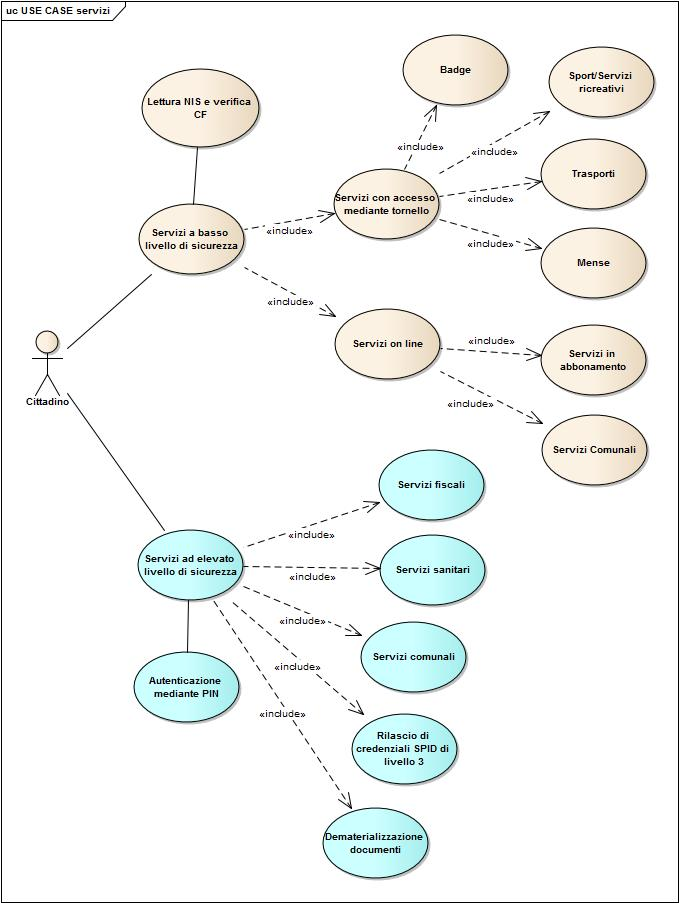
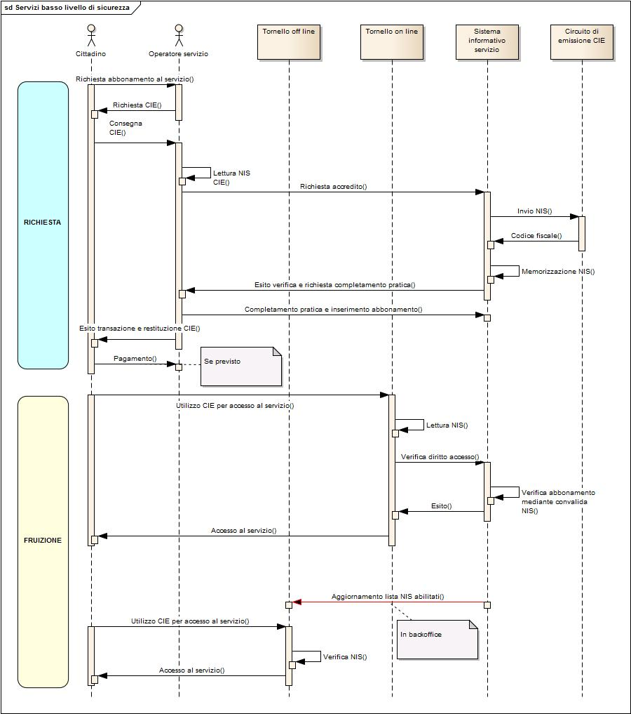
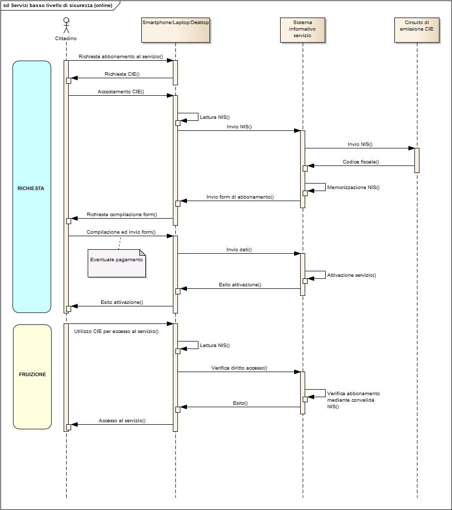
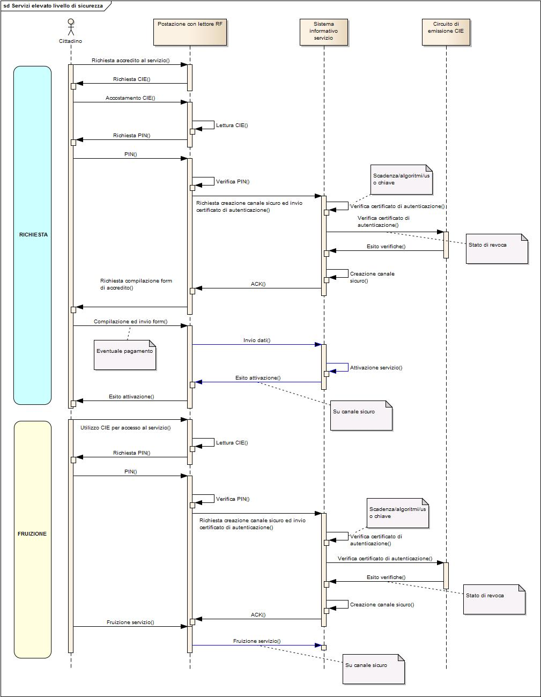

\ |image0|

Carta di Identità Elettronica

+------------------------------------------------------------------------------+
| |image1|                                                                     |
+==============================================================================+
| LA NUOVA CIE COME PIATTAFORMA PER LA REALIZZAZIONE DI SERVIZI AL CITTADINO   |
|                                                                              |
| 9 Gennaio 2017                                                               |
+------------------------------------------------------------------------------+

Sommario
========

`*1.* *Il chip contactless della nuova CIE*
2 <#il-chip-contactless-della-nuova-cie>`__

`*2.* *Modello di fruizione di servizi con bassi requisiti di sicurezza*
4 <#modello-di-fruizione-di-servizi-con-bassi-requisiti-di-sicurezza>`__

`*3.* *Modello di fruizione di servizi con elevati requisiti di
sicurezza*
6 <#modello-di-fruizione-di-servizi-con-elevati-requisiti-di-sicurezza>`__

Il chip contactless della nuova CIE
===================================

La nuova CIE è dotata di un microprocessore utilizzabile attraverso
un’interfaccia ‘senza contatti’: non è necessario inserire la carta in
un lettore, ma è sufficiente avvicinarla, senza contatto fisico. La
distanza di comunicazione dipende dalla potenza del lettore e
normalmente è dell’ordine di uno/due centimetri per i lettori
commerciali.

La carta può essere letta dai lettori utilizzati dalla strumentazione di
controllo presente, ad esempio, in frontiera, da lettori da tavolo
commerciali e da smartphone dotati di interfaccia NFC (Near Field
Communication); quest’ultimo aspetto consente un più facile utilizzo
della carta, vista la diffusione di smartphone e tablet dotati di
interfaccia NFC.

Il microprocessore della CIE offre nel dettaglio due funzionalità:
verifica dell’identità del titolare e accesso ai servizi. La prima
funzionalità è realizzata **dall’applicazione ICAO** (la stessa
utilizzata per il Permesso di Soggiorno Elettronico e per il Passaporto
Elettronico), la seconda funzionalità è realizzata dall’\ **applicazione
IAS** (Identification, Authentication, Segnature).

Nel dettaglio, l’applicazione IAS (Identification, Authentication,
Signature) offre due livelli di autenticazione:

-  Numero identificativo servizi (NIS);

-  Certificato di autenticazione.

Il **Numero Identificativo Servizi** è un numero sempre leggibile, senza
alcuna condizione di accesso. Può essere utilizzato per servizi che
hanno bisogno di un rapido accesso ma con bassi requisiti di sicurezza,
dove non è economicamente giustificato o tecnicamente realizzabile un
sistema più complesso. Il NIS non è ‘parlante’, ovvero dal numero non si
può risalire ai dati del titolare. La lettura di questo numero non offre
nessuna informazione sulla carta o sul suo proprietario. Dalla lettura
di tale numero è possibile tuttavia risalire al codice fiscale del
titolare della carta, interrogando un opportuno servizio messo a
disposizione dal Ministero dell’Interno.

L’autenticazione mediante certificato è invece utilizzabile per le
applicazioni con maggiori esigenze di sicurezza. L’autenticazione viene
avviata dal titolare che deve inserire uno specifico PIN di
autenticazione. Senza tale PIN non può essere letta alcuna informazione
dalla carta. Non è quindi possibile che qualcuno legga dati all’insaputa
del titolare od utilizzi la carta per scopi illeciti.

Una volta inserito il PIN, la carta invia un certificato di
autenticazione che contiene i dati del titolare, tra cui il codice
fiscale. Tutta la comunicazione viene cifrata con chiavi che vengono
modificate ad ogni sessione. Non è quindi possibile intercettare la
conversazione per captare i dati della carta.

Il diagramma di seguito esemplifica alcuni esempi di servizi attivabili
ed erogabili mediante la CIE, nei casi di bassi ed alti requisiti di
sicurezza.

|image2|

Figura 1. Esempio di servizi fruibili mediante CIE

Modello di fruizione di servizi con bassi requisiti di sicurezza
================================================================

Nei diagrammi seguenti vengono illustrati ad alto livello due scenari di
utilizzo di servizi mediante la CIE, per i quali è richiesto un basso
livello di sicurezza. In particolare il primo scenario analizza un
generico servizio la cui fruizione prevede l’accesso a dei tornelli, sia
nei casi in cui questi ultimi siano connessi in rete, sia nei casi in
cui essi siano offline. Il secondo scenario contempla l’attivazione e la
fruizione di servizi in abbonamento, in assoluta autonomia da parte del
cittadino. Piattaforme di fruizione, in tali casistiche, potrebbero
essere smartphone, tablet, desktop o laptop.

***Modello di fruizione di servizi con accesso a tornelli***

|image3|

***Modello di fruizione di servizi on line***

|image4|

Modello di fruizione di servizi con elevati requisiti di sicurezza
==================================================================

Il diagramma seguente illustra un tipico scenario di utilizzo della CIE
per l’attivazione e la fruizione di servizi a valore aggiunto che
richiedono un livello di sicurezza medio/alto. Il diagramma illustra il
processo di realizzazione del meccanismo di autenticazione in rete
mediante utilizzo del certificato di autenticazione a bordo della CIE.
Il processo di autenticazione è reso possibile mediante l’immissione del
PIN da parte del titolare della carta ed è richiesto sia in fase di
attivazione del servizio che in fase di fruizione.

|image5|

